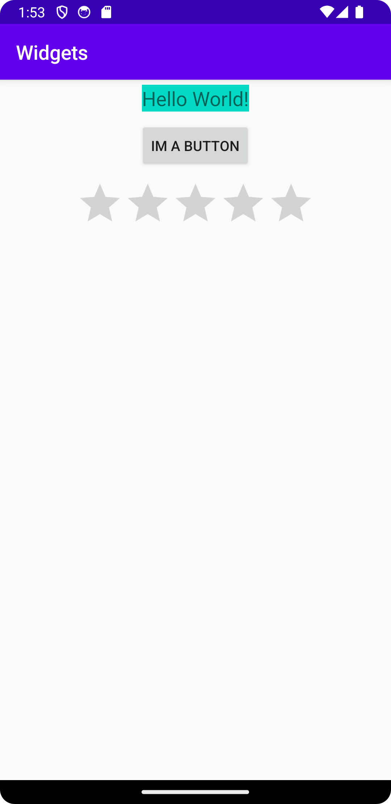

# Rapport

Lade till tre widgets: TextView, Button & RatingBar. Dessa ligger i en vertikal LinearLayout
och är centrerade på skärmen och har 5dp margin var. Button har en string som text från strings.xml.
Lade även till backgrundsfärg på TextView samt ökade textstorleken för ökad läsbarhet.

```
    <TextView
        android:layout_width="wrap_content"
        android:layout_height="wrap_content"
        android:text="Hello World!"
        android:layout_margin="5dp"
        android:textSize="20sp"
        android:background="@color/colorAccent" />

    <Button
        android:layout_width="wrap_content"
        android:layout_height="wrap_content"
        android:layout_margin="5dp"
        android:text="@string/im_a_button" />

    <RatingBar
        android:layout_width="wrap_content"
        android:layout_height="wrap_content"
        android:layout_margin="5dp"/>
```

